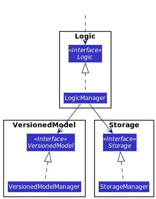
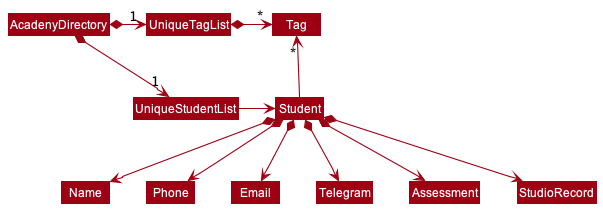
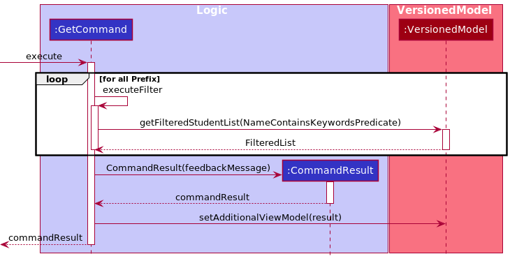
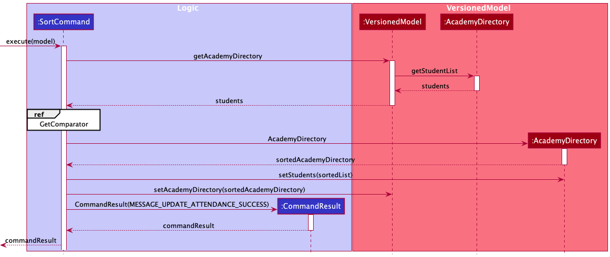
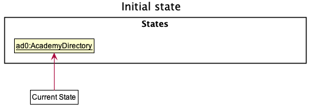
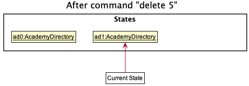
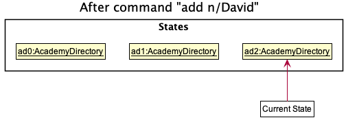
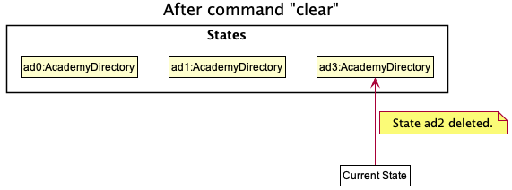
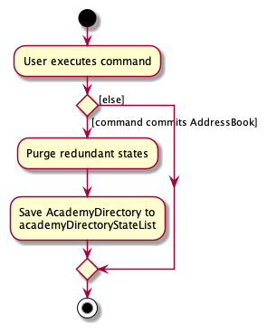

### Table of Contents
* [Acknowledgements](#acknowledgements)
* [Setting Up, Getting Started](#setting-up-getting-started)
* [Design](#design)
  * [Architecture](#architecture)
  * [UI Component](#ui-component)
  * [Logic Component](#logic-component)
  * [VersionedModel Component](#versionedmodel-component)
  * [Storage Component](#storage-component)
  * [Common Classes](#common-classes)
* [Implementation](#implementation)
  * [Managing Student's Personal Details](#managing-students-personal-details)
    * [AddCommand](#addcommand)
    * [DeleteCommand](#deletecommand)
    * [TagCommand](#tagcommand)
    * [GetCommand](#getcommand)
    * [EditCommand](#editcommand)
  * [Track Students' Grades, Studio Attendance, and Participation](#track-students-grades-studio-attendance-and-participation)
    * [GradeCommand](#gradecommand)
    * [AttendanceCommand](#attendancecommand)
    * [ParticipationCommand](#participationcommand)
  * [Visualization Tools](#visualization-tools)
    * [ViewCommand](#viewcommand)
    * [ShowCommand](#showcommand)
    * [VisualizeCommand](#visualizecommand)
    * [FilterCommand](#filtercommand)
    * [SortCommand](#sortcommand)
  * [Others](#others)
    * [ListCommand](#listcommand)
    * [ClearCommand](#clearcommand)
    * [UndoCommand](#undocommand)
    * [RedoCommand](#redocommand)
    * [HelpCommand](#helpcommand)
* [Guides](#guides)
* [Appendix](#appendix-requirements)
  * [Requirement](#appendix-requirements)
  * [Manual Testing](#appendix-instructions-for-manual-testing)
--------------------------------------------------------------------------------------------------------------------

## **Acknowledgements**

* TBC

--------------------------------------------------------------------------------------------------------------------

## **Setting Up, Getting Started**

Refer to the guide [_Setting up and getting started_](SettingUp.md).

--------------------------------------------------------------------------------------------------------------------

## **Design**

### Architecture

The ***Architecture Diagram*** given above explains the high-level design of the App.

Given below is a quick overview of main components and how they interact with each other.

**Main components of the architecture**

**`Main`** has two classes called [`Main`](https://github.com/AY2122S1-CS2103T-T15-3/tp/blob/master/src/main/java/seedu/academydirectory/Main.java) and [`MainApp`](https://github.com/AY2122S1-CS2103T-T15-3/tp/blob/master/src/main/java/seedu/academydirectory/MainApp.java). It is responsible for,
* At app launch: Initializes the components in the correct sequence, and connects them up with each other.
* At shut down: Shuts down the components and invokes cleanup methods where necessary.

[**`Commons`**](#common-classes) represents a collection of classes used by multiple other components.

The rest of the App consists of four components.

* [**`UI`**](#ui-component): The UI of the App.
* [**`Logic`**](#logic-component): The command executor.
* [**`VersionedModel`**](#versionedmodel-component): Holds the data of the App in memory.
* [**`Storage`**](#storage-component): Reads data from, and writes data to, the hard disk.

**How the architecture components interact with each other**

The *Sequence Diagram* below shows how the components interact with each other for the scenario where the user issues the command `delete 1`.

Each of the four main components (also shown in the diagram above),

* defines its *API* in an `interface` with the same name as the Component.
* implements its functionality using a concrete `{Component Name}Manager` class (which follows the corresponding API `interface` mentioned in the previous point.

For example, the `Logic` component defines its API in the `Logic.java` interface and implements its functionality using the `LogicManager.java` class which follows the `Logic` interface. Other components interact with a given component through its interface rather than the concrete class (reason: to prevent outside component's being coupled to the implementation of a component), as illustrated in the (partial) class diagram below.

The sections below give more details of each component.

### UI component

The **API** of this component is specified in [`Ui.java`](https://github.com/AY2122S1-CS2103T-T15-3/tp/blob/master/src/main/java/seedu/academydirectory/ui/Ui.java)

The UI consists of a `MainWindow` that is made up of parts e.g.`CommandBox`, `ResultDisplay`, `ChartDisplay`, `StudentListPanel`, `StatusBarFooter` etc. All these, including the `MainWindow`, inherit from the abstract `UiPart` class which captures the commonalities between classes that represent parts of the visible GUI.

The `UI` component uses the JavaFx UI framework. The layout of these UI parts are defined in matching `.fxml` files that are in the `src/main/resources/view` folder. For example, the layout of the [`MainWindow`](https://github.com/AY2122S1-CS2103T-T15-3/tp/blob/master/src/main/java/seedu/academydirectory/ui/MainWindow.java) is specified in [`MainWindow.fxml`](https://github.com/AY2122S1-CS2103T-T15-3/tp/blob/master/src/main/resources/view/MainWindow.fxml)

The `UI` component,

* executes user commands using the `Logic` component.
* listens for changes to `Model` data so that the UI can be updated with the modified data.
* keeps a reference to the `Logic` component, because the `UI` relies on the `Logic` to execute commands.
* depends on some classes in the `Model` component, as it displays `Student` object residing in the `Model` and requires grades statistics from `Student` object in the `Model`.

### Logic component

**API** : [`Logic.java`](https://github.com/AY2122S1-CS2103T-T15-3/tp/blob/master/src/main/java/seedu/academydirectory/logic/Logic.java)

Here's a (partial) class diagram of the `Logic` component:

How the `Logic` component works:
1. When `Logic` is called upon to execute a command, it uses the `AcademyDirectoryParser` class to parse the user command.
1. This results in a `Command` object (more precisely, an object of one of its subclasses e.g., `AddCommand`) which is executed by the `LogicManager`.
1. The command can communicate with the `Model` when it is executed (e.g. to add a student).
1. The result of the command execution is encapsulated as a `CommandResult` object which is returned back from `Logic`.

The Sequence Diagram below illustrates the interactions within the `Logic` component for the `execute("delete 1")` API call.

:information_source: **Note:** The lifeline for `DeleteCommandParser` should end at the destroy marker (X) but due to a limitation of PlantUML, the lifeline reaches the end of diagram.

Here are the other classes in `Logic` (omitted from the class diagram above) that are used for parsing a user command:

How the parsing works:
* When called upon to parse a user command, the `AcademyDirectoryParser` class creates an `XYZCommandParser` (`XYZ` is a placeholder for the specific command name e.g., `AddCommandParser`) which uses the other classes shown above to parse the user command and create a `XYZCommand` object (e.g., `AddCommand`) which the `AcademyDirectoryParser` returns back as a `Command` object.
* All `XYZCommandParser` classes (e.g., `AddCommandParser`, `DeleteCommandParser`, ...) inherit from the `Parser` interface so that they can be treated similarly where possible e.g, during testing.

### VersionedModel component
The `VersionedModel` API is a (disjoint) union of two interfaces: `Model` and `Version`. The `Model` API defines
methods to interface with domain data entities such as `Student` and user preference data i.e. `UserPref`. The `Version`
API defines methods to interface with version control entities such as `Commit`.

#### Model API
**API** : [`Model.java`](https://github.com/AY2122S1-CS2103T-T15-3/tp/blob/master/src/main/java/seedu/academydirectory/model/Model.java)

The `Model` component,

* stores the academy directory data i.e., all `Student` objects (which are contained in a `UniqueStudentList` object).
* stores the currently 'selected' `Student` objects (e.g., results of a search query) as a separate _filtered_ list which is exposed to outsiders as an unmodifiable `ObservableList<Student>` that can be 'observed' e.g. the UI can be bound to this list so that the UI automatically updates when the data in the list change.
* stores a `UserPref` object that represents the user’s preferences. This is exposed to the outside as a `ReadOnlyUserPref` objects.
* does not depend on any of the other three components (as the `Model` represents data entities of the domain, they should make sense on their own without depending on other components)

:information_source: **Note:** An alternative (arguably, a more OOP) model is given below. It has a `Tag` list in the `AcademyDirectory`, which `Student` references. This allows `AcademyDirectory` to only require one `Tag` object per unique tag, instead of each `Student` needing their own `Tag` objects. 

#### Version API
**API** : [`Version.java`](https://github.com/AY2122S1-CS2103T-T15-3/tp/blob/master/src/main/java/seedu/academydirectory/model/Version.java)

The `Version` component,

* stores version control entities such as current HEAD commit and `StageArea`
* depends on `VersionControlReader`, because the `Version` API requires frequent read access from disk to read
version control objects

Here's a (partial) class diagram of the Version component

### Storage component

**API** : [`Storage.java`](https://github.com/AY2122S1-CS2103T-T15-3/tp/blob/master/src/main/java/seedu/academydirectory/storage/Storage.java)

The `Storage` component,
* can save both academy directory data and user preference data in json format, and read them back into corresponding objects.
* inherits from both `AcademyDirectoryStorage` and `UserPrefStorage`, which means it can be treated as either one (if only the functionality of only one is needed).
* depends on some classes in the `Model` component (because the `Storage` component's job is to save/retrieve objects that belong to the `Model`)

### Common classes

Classes used by multiple components are in the `seedu.academydirectory.commons` package.

### More Design Details of Version

--------------------------------------------------------------------------------------------------------------------

## **Implementation**

This section describes some noteworthy details on how certain features are implemented.

### Managing Students' Personal Details
### AddCommand

This command adds a new `Student` to `AcademyDirectory`.

#### Implementation
`AddCommand` will extend the `Command` class and will consequently `@Override` the `Command#execute()` method to serve the aforementioned purpose and is Version Controllable.

`AddCommand` adds students to the `AcademyDirectory`, with prevention of duplicates by ensuring that each `Student` has a unique `NAME`. 
`NAME` is a sufficiently unique field to identify a unique instance of a student as for the purposes of `AcademyDirectory` is scoped to 
service CS1101S Avengers, each `Studio` has approximately 10 `Students`, with the probability of a `NAME` collision being sufficiently minimised.

:information_source: **Note:** The responsibility of ensuring that `Student` 
does not have unnecessary duplicate information (e.g same `PHONE`) is left to an Avenger.

### DeleteCommand

This command deletes a `Student` from `AcademyDirectory`.

#### Implementation
`DeleteCommand` will extend the `Command` class and will consequently `@Override` the `Command#execute()` method to serve the aforementioned purpose and is Version Controllable.

`DeleteCommand` deletes `Student` based on the relative `INDEX` in the `ObservableList` which is the list of `Student` viewed by the `Avenger`. To do this, `DeleteCommand` makes a call to `Model#deleteStudent()`.

### TagCommand

#### Implementation

### GetCommand
This command serves to retrieve a specific `Information` of students.

#### Implementation
`GetCommand` will extend the `Command` class and will consequently `@Override` the `Command#execute()` method to serve the aforementioned purpose.

All fields of `Student` class which implements the `Information` interface and whose prefix is present in the `InformationWantedFunction` class
can be queried by `GetCommand`. Hence, for an `Information` to be query-able, it _must_ implement the `Information` interface and its prefix needs
to be added to the list of supported prefix under `InformationWantedFunction`. If at least one of the two conditions are not fulfilled, compile errors
will be thrown. The following is the class diagram for `GetCommand`.

A `GetCommand` is initialized with a list of `InformationWantedFunction` objects to retrieve the necessary information. Obtaining the queried information
is done by using the `InformationWantedFunction` objects on all `Student` objects in the model. The specific is shown in the sequence diagram below:

Exactly which field of `Student` should be retrieved is determined by the `Prefix` passed into `InformationWantedFunction` during its creation.

### EditCommand

This command edits a `Student`'s personal details such as their `NAME`, `PHONE`, `TELEGRAM` and `EMAIL`.

#### Implementation
`EditCommand` will extend the `Command` class and will consequently `@Override` the `Command#execute()` method to serve the aforementioned purpose and is Version Controllable.

Similar to `AddCommand`, `EditCommand` supports duplicate prevention by checking that the `NAME` being edited is unique in the list
unless the `NAME` is the same  as the `Student` being edited.

:information_source: **Note:** The responsibility of ensuring that `Student` 
does not have unnecessary duplicate information (e.g same `PHONE`) is left to an Avenger.

### Track Students' Grades, Studio Attendance, and Participation

### GradeCommand

This command serves to update the `Grade` of various `Assessment` that the students will undergo in CS1101S. The assessments include RA1, Midterm, RA2, Practical Exam (PE), and Final.

#### Implementation

`GradeCommand` will extend the `Command` class and will consequently `@Override` the `Command#execute()` method to serve the aforementioned purpose.

The recording of grade is facilitated by adding an `Assessment` parameter to the `Student`.
The `Assessment` is implemented with a HashMap that stores the String representation of the assessments as the keys, and the integer `Grade` as the values.

The following sequence diagram describes what happens when `GradeCommand` is executed:

### AttendanceCommand

This command serves to update the attendance status of students. A student's `Attendance` can be either attended or unattended.

#### Implementation

`AttendanceCommand` will extend the `Command` class and will consequently `@Override` the `Command#execute()` method to serve the aforementioned purpose and is Version Controllable.

The attendance mechanism is facilitated by adding a `StudioRecord` parameter to the `Student`. This `StudioRecord` has an `Attendance` object which we can use to track and update the `Attendance` of the `Student`. `Attendance` implements `Information` and the actual storing of the attendance status is done with a `boolean array`.

The following sequence diagram describes what happens when `AttendanceCommand` is executed:

For `UpdateModelAttendanceSequenceDiagram`, the sequential diagrams can be found below:

### ParticipationCommand

This command serves to update the `Participation` score of students. Following the XP system for CS1101S, each student is awarded between 0 and 500 XP (inclusive) per Studio session.

#### Implementation

`ParticipationCommand` will extend the `Command` class and will consequently `@Override` the `Command#execute()` method to serve the aforementioned purpose and is Version Controllable.

The implementation is similar to `AttendanceCommand`, with the same sequence diagram being applicable for Participation given that the proper refactoring to `Participation` is done.

`ParticipationCommand` has an additional section in the sequence diagram located above the loop in `AttendanceCommand`. The purpose of the logic below is to update a student's `Attendance` to be marked as present if the `participationUpdate` is greater than 0. This is because a student that has a positive `Participation` score would also count as having attended the `Studio`.

:information_source: **Note:** The logic above is to update the `Attendance` and is only executed in the event that `participationUpdate` is more than 0. Otherwise, it will not run.

 

### Visualization Tools

### ViewCommand

This command serves to display the summarised details of a single `Student` in the `AcademyDirectory`.

`ViewCommand` displays the `Student` based on the relative `INDEX` in the `ObservableList` which is the list of `Student` viewed by the `Avenger`.

{Improve on explanation and add a possible UML Diagram}

#### Implementation

`ViewCommand` will extend the `Command` class and will consequently `@Override` the `Command#execute()` method to serve the aforementioned purpose.

### ShowCommand

This command serves to display the collated score of all students in the Academy Directory for a specific `Assessment`. The assessments that can be queried are: RA1, Midterm, RA2, Practical Exam (PE), and Final.

#### Implementation

`ShowCommand` will extend the `Command` class and will consequently `@Override` the `Command#execute()` method to serve the aforementioned purpose.

The grades are collated by iterating through all the students and extracting the score from the `Assessment` HashMap using the input `Assessment` as the key.
The information is formatted into a String and displayed in the AdditionalView. The success message is parsed into `CommandResult` to be returned by `ShowCommand`.

The following sequence diagram describes what happens when `ShowCommand` is executed:

### VisualizeCommand

This command provides a Box Plot of the performance of all `Student` in `AcademyDirectory` in all `Assessment`.

#### Implementation

`VisualizeCommand` will extend the `Command` class and will consequently `@Override` the `Command#execute()` method to serve the aforementioned purpose.

{Improve on explanation and add a possible UML Diagram}

### FilterCommand

This command filters the `ObservableList` by `NAME` or `TAG`.  

#### Implementation

`FilterCommand` will extend the `Command` class and will consequently `@Override` the `Command#execute()` method to serve the aforementioned purpose.

{Improve on explanation and add a possible UML Diagram}

### SortCommand

This command sorts the `AcademyDirectory` student list based on their `Participation`, `Assessment` and `Name`. When sorting by `Assessment`, users have the option of sorting by individual `Assessment` or by the average grade among. Users can also choose if they want to sort by ascending or descending.

#### Implementation

`SortCommand` will extend the `Command` class and will consequently `@Override` the `Command#execute()` method to serve the aforementioned purpose.

The sorting mechanism is based on the `List` interface as it sorts the various `FilteredList` instances using `Comparator`. Based on the `attribute` of the `SortCommand` being executed, the `Comparator` differs as shown by the sequential diagram below:

The reference frame for GetComparator can be found below. It details the selection process based on the `attribute` of the `SortCommand`.

### Others

### ListCommand

This command restores the original, unfiltered view of `AcademyDirectory`.

#### Implementation

`ListCommand` will extend the `Command` class and will consequently `@Override` the `Command#execute()` method to serve the aforementioned purpose.

### ClearCommand

This command clears all `Student` entries from `AcademyDirectory`.

#### Implementation

`ClearCommand` will extend the `Command` class and will consequently `@Override` the `Command#execute()` method to serve the aforementioned purpose and is Version Controllable.

### UndoCommand
#### Implementation

### \[Proposed\] Undo/Redo feature

#### Proposed Implementation

The proposed undo/redo mechanism is facilitated by `VersionedAcademyDirectory`. It extends `AcademyDirectory` with an undo/redo history, stored internally as an `academyDirectoryStateList` and `currentStatePointer`. Additionally, it implements the following operations:

* `VersionedAcademyDirectory#commit()` — Saves the current academy directory state in its history.
* `VersionedAcademyDirectory#undo()` — Restores the previous academy directory state from its history.
* `VersionedAcademyDirectory#redo()` — Restores a previously undone academy directory state from its history.

These operations are exposed in the `Model` interface as `Model#commitAcademyDirectory()`, `Model#undoAcademyDirectory()` and `Model#redoAcademyDirectory()` respectively.

Given below is an example usage scenario and how the undo/redo mechanism behaves at each step.

Step 1. The user launches the application for the first time. The `VersionedAcademyDirectory` will be initialized with the initial academy directory state, and the `currentStatePointer` pointing to that single academy directory state.

Step 2. The user executes `delete 5` command to delete the 5th student in the academy directory. The `delete` command calls `Model#commitAcademyDirectory()`, causing the modified state of the academy directory after the `delete 5` command executes to be saved in the `academyDirectoryStateList`, and the `currentStatePointer` is shifted to the newly inserted academy directory state.

Step 3. The user executes `add n/David …​` to add a new student. The `add` command also calls `Model#commitAcademyDirectory()`, causing another modified academy directory state to be saved into the `academyDirectoryStateList`.

:information_source: **Note:** If a command fails its execution, it will not call `Model#commitAcademyDirectory()`, so the academy directory state will not be saved into the `academyDirectoryStateList`.

Step 4. The user now decides that adding the student was a mistake, and decides to undo that action by executing the `undo` command. The `undo` command will call `Model#undoAcademyDirectory()`, which will shift the `currentStatePointer` once to the left, pointing it to the previous academy directory state, and restores the academy directory to that state.

:information_source: **Note:** If the `currentStatePointer` is at index 0, pointing to the initial AcademyDirectory state, then there are no previous AcademyDirectory states to restore. The `undo` command uses `Model#canUndoAcademyDirectory()` to check if this is the case. If so, it will return an error to the user rather
than attempting to perform the undo.

The following sequence diagram shows how the undo operation works:

:information_source: **Note:** The lifeline for `UndoCommand` should end at the destroy marker (X) but due to a limitation of PlantUML, the lifeline reaches the end of diagram.

The `redo` command does the opposite — it calls `Model#redoAcademyDirectory()`, which shifts the `currentStatePointer` once to the right, pointing to the previously undone state, and restores the academy directory to that state.

:information_source: **Note:** If the `currentStatePointer` is at index `academyDirectoryStateList.size() - 1`, pointing to the latest academy directory state, then there are no undone AcademyDirectory states to restore. The `redo` command uses `Model#canRedoAcademyDirectory()` to check if this is the case. If so, it will return an error to the user rather than attempting to perform the redo.

Step 5. The user then decides to execute the command `list`. Commands that do not modify the academy directory, such as `list`, will usually not call `Model#commitAcademyDirectory()`, `Model#undoAcademyDirectory()` or `Model#redoAcademyDirectory()`. Thus, the `academyDirectoryStateList` remains unchanged.

Step 6. The user executes `clear`, which calls `Model#commitAcademyDirectory()`. Since the `currentStatePointer` is not pointing at the end of the `academyDirectoryStateList`, all academy directory states after the `currentStatePointer` will be purged. Reason: It no longer makes sense to redo the `add n/David …​` command. This is the behavior that most modern desktop applications follow.

The following activity diagram summarizes what happens when a user executes a new command:

#### Design considerations:

**Aspect: How undo & redo executes:**

* **Alternative 1 (current choice):** Saves the entire academy directory.
    * Pros: Easy to implement.
    * Cons: May have performance issues in terms of memory usage.

* **Alternative 2:** Individual command knows how to undo/redo by
  itself.
    * Pros: Will use less memory (e.g. for `delete`, just save the student being deleted).
    * Cons: We must ensure that the implementation of each individual command are correct.

_{more aspects and alternatives to be added}_

### RedoCommand
#### Implementation

### HelpCommand

This command serves to guide new users on using the application, which syntax to use and when to use them. Users can view a summary of all commands' syntax,
or a specific guide on how to use a particular command.

#### Implementation

`HelpCommand` will extend the `Command` class, and consequently `@Override` the `Command#execute()` method to serve its initial purposes.

The mechanism of the command is done by retrieving a `HELP_MESSAGE` field in each of the other command classes (other than HelpCommand itself). This help command will
be displayed to the user on a separate window later on.

As seen from the diagram, the `HelpCommand` involves the use of conditional branches. If the optional condition is met, a `CommandException` is thrown to let
users know that the input is invalid.

Otherwise, the HelpCommand will use conditional branch to guide users to two different scenarios, as shown above. If it is a general help, a general help command
will be created. If it is a specific help, then a specific help command associated with a command will be created.

### \[Proposed\] Data archiving

_{Explain here how the data archiving feature will be implemented}_

--------------------------------------------------------------------------------------------------------------------

## **Guides**

The following links to guides on: Documentation, Logging, Testing, Configuration, Dev-Ops.

* [Documentation guide](Documentation.md)
* [Testing guide](Testing.md)
* [Logging guide](Logging.md)
* [Configuration guide](Configuration.md)
* [DevOps guide](DevOps.md)

--------------------------------------------------------------------------------------------------------------------

## Appendix: Requirements

### Product scope

**Target user profile**:

* has a need to manage a significant number of contacts
* can type fast
* prefers typing to mouse interactions
* is reasonably comfortable using CLI apps
* is an Avenger for CS1101S (a tutor in CS1101S is known as an Avenger)

**Value proposition**:

Currently, Avengers are able to utilise Source Academy as a platform to aid in their students'
learning. However, there is no proper feature that allows Avengers to
maintain a nominal roll for their class, or to track their students' performance.

Academy Directory is designed to fill that gap! It is specifically tailored to help Avengers
better manage their students. The app provides ease of communication, and allows Avengers to
track their students' performance, in terms of attendance, participation and assessments.

### User stories

Priorities: High (must have) - `* * *`, Medium (nice to have) - `* *`, Low (unlikely to have) - `*`

| Priority | As a …​                | I want to …​                                                    | So that I can…​                                                     |
| -------- | --------------------------| ------------------------------------------------------------------ | ---------------------------------------------------------------------- |
| `* * *`  | CS1101S Avenger           | add, delete and edit student's information                         | update my class list                                                   |
| `* * *`  | CS1101S Avenger           | retrieve specific details of a student                             | view and analyse the data                                              |
| `* * *`  | CS1101S Avenger           | keep track of my students' tutorial performance                    | accurately reward class participation marks                            |
| `* * *`  | CS1101S Avenger           | record my students' assessment results                             | monitor my students' progress and provide timely assistance to them    |
| `* * *`  | first time user           | access the relevant commands with a "help" command                 | learn how to use the app more easily                                   |
| `* *`    | CS1101S Avenger           | view the average scores of my students for specific assessments    | focus on the aspects to improve on during tutorial                     |
| `* *`    | CS1101S Avenger           | visualize the class scores for specific assessments                | gauge how well my students are doing in assessments                    |
| `* *`    | CS1101S Avenger           | add tags to certain students to take note of their weaker topics   | focus on topics that they are struggling with                          |
| `* `     | experienced user          | make custom commands                                               | I can issue my commonly used commands faster                           |

### Use cases

(For all use cases below, the **System** is the `AcademyDirectory` and the **Actor** is the `User`, unless specified otherwise)

**Use case: Seeking help**

**MSS**

1. User requests for assistance
2. Academy Directory shows a list of all commands available
3. User requests for help in a specific command
4. Academy Directory shows the User Guide instructions for that command
   
   Use case ends

**Extensions**
* 3a. User requests for the syntax of all commands
  *  3a1. Academy Directory shows a list of all the commands and their associated syntax.
    
     Use case ends
* 3b. User requests for help in a command that does not exist
  * 3b1. Academy Directory shows an error message
    
    Use case resumes at step 2.

**Use case: Delete a student**

**MSS**

1.  User requests to list students
2.  AcademyDirectory shows a list of students
3.  User requests to delete a specific student in the list
4.  AcademyDirectory deletes the student

    Use case ends.

**Extensions**

* 2a. The list is empty.

  Use case ends.

* 3a. The given index is invalid.

    * 3a1. AcademyDirectory shows an error message.

      Use case resumes at step 2.

**Use case: Edit a student**

**MSS**

1.  User requests to list students
2.  AcademyDirectory shows a list of students
3.  User requests to edit a specific student in the list
4.  AcademyDirectory edit the student

    Use case ends.

**Extensions**

* 2a. The list is empty.

  Use case ends.

* 3a. The given index is invalid.

    * 3a1. AcademyDirectory shows an error message.

      Use case resumes at step 2.

**Use case: Update Studio attendance of student**

**MSS**

1.  User requests to list students attending the relevant Studio session
2.  AcademyDirectory shows a list of students attending the relevant Studio session
3.  User requests to update the attendance of the student in the relevant Studio session
4.  AcademyDirectory updates the student's attendance for the relevant Studio session

    Use case ends.

**Extensions**

* 1a. The given index for the Studio group is invalid.

  * 1a1. AcademyDirectory shows an error message.
      Use case resumes at step 1.

* 1b. The given index for the Studio group's Studio session is invalid.

  * 1b1. AcademyDirectory shows an error message.
      Use case resumes at step 1.

* 2a. The list is empty.

  Use case ends.

* 3a. The given keyword to search for the student is gives no result.

    * 3a1. AcademyDirectory shows an error message.

      Use case resumes at step 2.

**Use case: Update Studio participation of student**

**MSS**

1. User requests to list students attending the relevant Studio session
2. AcademyDirectory shows a list of students attending the relevant Studio session
3. User requests to update the Studio participation of the student in the relevant Studio session with the appropriate Studio participation score
4. AcademyDirectory updates the student's Studio participation for the relevant Studio session

    Use case ends.

**Extensions**

* 1a. The given index for the Studio group is invalid.

    * 1a1. AcademyDirectory shows an error message.

      Use case resumes at step 1.

* 1b. The given index for the Studio group's Studio session is invalid.

    * 1b1. AcademyDirectory shows an error message.

      Use case resumes at step 1.

* 2a. The list is empty.

  Use case ends.

* 3a. The given keyword to search for the student is gives no result.

    * 3a1. AcademyDirectory shows an error message.

      Use case resumes at step 2.

* 3b. The given Studio participation score is invalid (non-integer).

    * 3b1. AcademyDirectory shows an error message.

      Use case resumes at step 2.

**Use case: Add student's grade for an assessment**

**MSS**

1. User enters a command to add the grade for an assessment to a student.
2. AcademyDirectory checks for existing instance of the assessment.
3. AcademyDirectory records the input grade for the assessment.
   
    Use case ends.

**Extensions**

* 1a. The student's name does not match any of the names in the directory.

    * 1a1. AcademyDirectory shows an error message.

      Use case resumes at step 1.
    
* 1b. The input grade is not a positive integer.

    * 1b1. AcademyDirectory requests for user to enter a positive integer.

      Use case resumes at step 1.

* 2a. The assessment already exists.

    * 2a1. AcademyDirectory edits the grade for the existing assessment.

      Use case ends.

* 2b. The assessment is new.

    * 2b1. AcademyDirectory adds a new assessment with the input grade.

      Use case ends.

**Use case: Show grades for an assessment**

**MSS**

1. User enters a command to display the grades for an assessment.
2. AcademyDirectory parses through the students to obtain the grades.
3. AcademyDirectory displays a list of students with the grades.

   Use case ends.

**Extensions**

* 1a. The assessment does not exist.

    * 1a1. AcademyDirectory shows an error message.
    * 1a2. AcademyDirectory requests for the user to try another assessment.

      Use case resumes at step 1.

**Use case: Retrieve information**

**MSS**

1. User enters a command to retrieve information
2. AcademyDirectory obtain the queried information from the students.
3. AcademyDirectory displays the list of information queried.

   Use case ends.

**Extensions**

* 1a. User specifies exact student name.

    * 1a1. AcademyDirectory displays the queried information associated with the queried student.
  
         Use case ends.
  
* 1a. User's queried information is not supported 
    * 1a1. AcademyDirectory shows an error message.
    * 1a2. AcademyDirectory requests for the user to try another information.
  
        Use case ends.

### Non-Functional Requirements

1. Should work on any _mainstream OS_ as long as it has Java `11` or above installed.
2. Should be able to hold up to _3000_ student without a noticeable sluggishness in performance for typical usage.
3. A user with above-average typing speed for regular English text (i.e. not code, not system admin commands) should be able to accomplish most of the tasks faster using commands than using the mouse.
4. Should work in computer with `32-bit` or `64-bit` processor.
5. Should run on user computer with double-click - no installer or additional libraries required.
6. Should not require internet connection for any of its feature.
7. All user and app data should be stored locally, not through an online database solution.
8. Logs and previous commits stored should be based on the _Principle of Least-Privilege_.
9. Logs and previous commits should be recoverable even when `AcademyDirectory` itself is deleted.
10. Logs and previous commits should be transferable and functional after transfer onto other computers.

### Glossary

* **Mainstream OS**: Windows, Linux, Unix, OS-X
* **Private contact detail**: A contact detail that is not meant to be shared with others
* **Studios**: A tutorial held in CS1101S and is essential in aiding the students to improve their grasp on the concepts taught during the lecture.
* **Avenger**: a CS1101S tutor, responsible for building on concepts and recording attendance and grades.
* **Principle of Least-Privilege**: Minimum levels of access – or permissions – needed to perform function.
* **Version Controllable**: Refers to a `Command` that logs a `Commit` object upon execution.
--------------------------------------------------------------------------------------------------------------------

## **Appendix: Instructions for manual testing**

Given below are instructions to test the app manually.

:information_source: **Note:** These instructions only provide a starting point for testers to work on;
testers are expected to do more *exploratory* testing.

### Launch and shutdown

1. Initial launch

   1. Download the jar file and copy into an empty folder

   1. Double-click the jar file Expected: Shows the GUI with a set of sample contacts. The window size may not be optimum.

1. Saving window preferences

   1. Resize the window to an optimum size. Move the window to a different location. Close the window.

   1. Re-launch the app by double-clicking the jar file. 
       Expected: The most recent window size and location is retained.

1. _{ more test cases to come …​ }_

### Deleting a student

1. Deleting a student while all students are being shown

   1. Prerequisites: List all students using the `list` command. Multiple students in the list.

   1. Test case: `delete 1` 
      Expected: First contact is deleted from the list. Details of the deleted contact shown in the status message. Timestamp in the status bar is updated.

   1. Test case: `delete 0` 
      Expected: No student is deleted. Error details shown in the status message. Status bar remains the same.

   1. Other incorrect delete commands to try: `delete`, `delete x`, `...` (where x is larger than the list size) 
      Expected: Similar to previous.

1. _{ more test cases to come …​ }_

### Saving data

1. Dealing with missing/corrupted data files

   1. _{explain how to simulate a missing/corrupted file, and the expected behavior}_

1. _{ more test cases to come …​ }_
